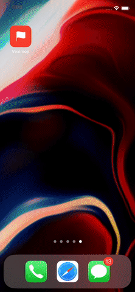

# Veximoji Example App
A non-trivial iOS app that showcases the [Veximoji](https://github.com/roz0n/Veximoji) Swift package

## Demo

## Requirements
- Xcode 11+
- iOS 13+
- Swift 5+

## Usage
Follow standard iOS development conventions:

1. Clone the repo: `git clone https://github.com/roz0n/Veximoji-Example.git`
2. Open `Veximoji-Example` in the project navigator, and select the `Signing & Capabilities` tab. Change the team from the dropdown menu to your own account.
3. Xcode should install the `Veximoji` package automatically upon building the app, but In the event it doesn’t, click: `File > Swift Packages > Update to Latest Package Versions`
4. Build the app: `⌘ + R`

## Support
Feel free to email me at: [arnold@rozon.org](mailto:arnold@rozon.org)

## License
MIT
